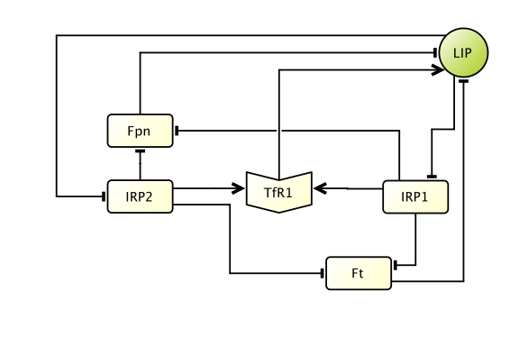

```{r setup, include=FALSE}
knitr::opts_chunk$set(echo = TRUE)
```

# Ternary Networks

A ternary network is a pair $\mathcal{T}=(G, F)$, where $G$ is a digraph on $n$ nodes and $F = (f_1, \dots, f_n): \{0,1,2\}^n \to \{0,1,2\}^n$ is a global transition function. Each node $v$ in $G$ takes on the values in the set $\{0,1,2\}$ and is updated by a local activation function $f_v:\{0,1,2\}^n \to \{0,1,2\}$. The value of the function $f_v$ depends on its input nodes and their current state. The update schedule is *synchronous* meaning that all nodes in the network are updated simultaneously.


## Example

To make terminology precise and clear we will use one of our previously published models of intracellular iron metabolism https://doi.org/10.1371/journal.pcbi.1005352. We have selected a portion of the network termed *Iron Homeostasis Pathway* in the article (Fig 1. Intracellular iron network). Note that Hepcidin was excluded, which resulted in the network on six nodes (image below). We will also demonstrate functionalities and tools of the *SteadyCellPhenotype* on the full 24-node model (see Section [*SteadyCellPhenotype* tools](#tools)). 



# *SteadyCellPhenotype* tools {#tools}